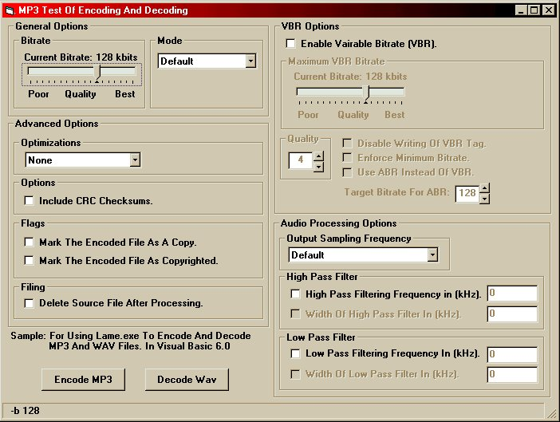



## MP3 Shelled Encoder/Decoder

### Description

Source code to shell the lame.exe program in the background. Will Encode WAV Files to MP3, And Decode MP3 Files to WAV Files. Shows How to use Slider controls and loads and saves the applications options. Needs the lame_enc.dll and lame.exe to get these read the readmefirst.txt file, or I will email them to you.
 
### More Info
 
MP3 or WAV files

read the switches.html file for the lame MP3 switches the source code is fully commented!

No known side effects

             |
---                |---
**Submitted On**   |2001-05-13 17:53:36
**By**             |[Ray King](https://github.com/Planet-Source-Code/PSCIndex/blob/master/ByAuthor/ray-king.md)
**Level**          |Advanced
**User Rating**    |4.8 (19 globes from 4 users)
**Compatibility**  |VB 6\.0
**Category**       |[Sound/MP3](https://github.com/Planet-Source-Code/PSCIndex/blob/master/ByCategory/sound-mp3__1-45.md)
**World**          |[Visual Basic](https://github.com/Planet-Source-Code/PSCIndex/blob/master/ByWorld/visual-basic.md)
**Archive File**   |[MP3 Shelle195915132001\.zip](https://github.com/Planet-Source-Code/ray-king-mp3-shelled-encoder-decoder__1-23166/archive/master.zip)

